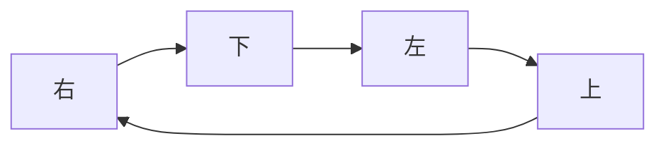

@[TOC](矩阵的螺旋输出：[Python][C]实现)

>   版权声明：
>   如要转载，请与我联系。
<hr style=" border:solid; width:100px; height:1px;" color=#000000 size=1">

# 1. 问题概述
给定一个M*N（M行，N列）的矩阵，以螺旋的顺序返回矩阵所有元素。

本文以顺时针螺旋为例。 :D

***关键词：二维数组、螺旋输出、遍历***

---
# 2. 思路构建
最近在做CCFCSP。但是CCFCSP上没有这个题，所以这个题是我虚构的。

CCFCSP的题目通常会给出$m$、$n$的大小；

然后依次输入$m×n$二维数组的元素。

补充：假设$0<m<n<100$

例如

|说明|输入|输出|
|:-:|:--:|:----:|
|第1行|3 3|1 2 3 6 9 8 7 4 5
|第2行|1 2 3|
|第3行|4 5 6|
|第3行|7 8 9|

---
# 3. 程序实现
下面两种方法，方法一是Python实现，方法二是C语言实现。两种语言用的方法不一样，请家人们自行选择观看。

---
## 3.1 方法一
按照矩阵的“厚度”循环。

即第t次循环以t，t为起点以(t+1，t)为终点画圈，直到将Matrix螺旋遍历完毕；

这种方式理解起来非常简单，<font color=red>**社区里很多人都写。**</font>

这里不多做赘述，下面直接放python实现的代码。

**注：Python接收的是一个二维列表**
```py
def SpiralOrder():
    d=0
    List=[]
    while 2*d<LenM and 2*d<LenN:
        for j in range(d,LenN-d):
            List.append(matrix[d][j])
        for i in range(d+1,LenM-d):
            List.append(matrix[i][LenN-1-d])
        if LenM-2*d!=1:    
            for j in range(LenN-d-2,d-1,-1):
                List.append(matrix[LenM-1-d][j])
        if LenN-2*d!=1:    
            for i in range(LenM-d-2,d,-1):
                List.append(matrix[i][d])
        d+=1   
    return List

matrix=eval(input())
if matrix!=[]:
    LenN=len(matrix[0])
    LenM=len(matrix)
    res=SpiralOrder()
    print(res)
else:
    print([])
```
---
## 3.2 方法二

重点来说说方法二

画出数组的<font color=red>**“地图”**</font>，若碰到地图的<font color=red>**“边界”**</font>或<font color=red>**已遍历过的“区域”**</font>，就改变<font color=red>**“方向”**</font>。遍历结束后<font color=red>**退出程序**</font>即可；

敲黑板!!!这几个词下面要考

---
### 3.2.1 发现 :D

顺时针旋转的呈现出<font color=red>**规律性**</font>：

向右遍历、向下遍历、向左遍历、向上遍历、向右遍历...

如此往复，如下图



就如同我们<font color=red>**贴左侧墙开车，一直右转**</font>

因此只需将遍历索引写成顺序<font color=red>**右转**</font>的即可。

---

### 3.2.2 关键准备工作 :D

写程序就如同炒菜，要做一些准备
```cpp
struct Direction{
    int i,j;
}Go[4]={{0,1},{1,0},{0,-1},{-1,0}};
/*定义一个结构体储存行径的方向*/

int t=0;
/*以及一个全局变量作为行径方向的索引,用t++和t%4的方式可以让行径方向循环*/

char map[N][N];
/*地图用来记录边界条件和已访问过的位置*/

int Element[N][N];
/*二维数组矩阵用来储存题目给出的二维数组*/
```

---
### 3.2.3 核心算法 :D :D 
---

通过索引进入矩阵，首先要将矩阵的当前值带出来；

其次，既然已经读取了，就要在地图上记录访问过该点了

将两句伪代码打包写成一个函数
```cpp
void OutTunnelsOrder(int x,int y)
{
    printf("%d",Element[x][y]);
    printf(" ");
    map[x][y]='#';//留下位置
}
```
---

显然，我们还要进行判断

判断下个要去的矩阵点是否可进入。

如果不能进入要调整行径方向的索引。
```cpp
int JadgeDextroversion(int x,int y)//对坐标进行判断
{
    if(map[x][y]=='#')
    {
        t++;//调整坐标索引
        return 0;
    }
    return 1;
}
```

---
很容易得知，需要进行两次判断。

1. 判断下一次的索引坐标是否可以走。若可走，则将索引坐标赋给next；若不可走，根据判断程序会更改坐标索引(t++)，再将索引坐标赋给next；
2. 判断被赋值的next，若可走，则进行next坐标的读取；若不可走，则说明已经遍历完毕了，得退出程序。
```cpp
void SpiralOrder(int x,int y)
{
    JadgeDextroversion(x+Go[t%4].i,y+Go[t%4].j);
    //判断下一次的索引坐标
    OutTunnelsOrder(x,y);
    nextx=x+Go[t%4].i;
    nexty=y+Go[t%4].j;
    if(JadgeDextroversion(nextx,nexty))
    //判断被赋值的next
    {
        SpiralOrder(nextx,nexty);//递归进行下一个坐标
    }
    else
    {
        exit(0);
    }
}
```
---
### 3.2.4 完整程序 :D
```cpp
/*
    filename:MatrixSpiral.c
    author:Lyn#reo
    create:2020.10.18
    #可以根据需要修改
    #如有二次发送的必要
    #请留下修改者和修改日期:)
    #感激您的真诚#
*/
#include<stdio.h>
#include<string.h>
#include<stdlib.h>
#define N 102
/*定义一个结构体储存行径的方向*/
struct Direction{
    int i,j;
}Go[4]={{0,1},{1,0},{0,-1},{-1,0}};

/*以及一个全局变量作为行径方向的索引*/
int t=0;

int nextx,nexty;
char map[N][N];
int Element[N][N];

int JadgeDextroversion(int x,int y)//对坐标进行判断
{
    if(map[x][y]=='#')
    {
        t++;//调整坐标索引
        return 0;
    }
    return 1;
}

void OutTunnelsOrder(int x,int y)
{
    printf("%d",Element[x][y]);//输出指令
    printf(" ");
    map[x][y]='#';//留下标记
}

void SpiralOrder(int x,int y)
{
    JadgeDextroversion(x+Go[t%4].i,y+Go[t%4].j);
    //判断下一次的索引坐标
    OutTunnelsOrder(x,y);
    nextx=x+Go[t%4].i;
    nexty=y+Go[t%4].j;
    if(JadgeDextroversion(nextx,nexty))
    //判断被赋值的next
    {
        SpiralOrder(nextx,nexty);//递归进行下一个坐标
    }
    else
    {
        exit(0);
    }
}

int main()
{
    memset(map,'#',sizeof(map));
    memset(Element,0,sizeof(Element));

    int m,n;
    scanf("%d%d",&m,&n);
    int i,j;
    for(i=1;i<m+1;i++)
    {
        for(j=1;j<n+1;j++)
        {
            scanf("%d",&Element[i][j]);
            map[i][j]='\0';
        }
    }
    SpiralOrder(1,1);//从(1,1)进入
    return 0;
}
```
---
# 4 写在最后
文案、代码、制作:Lyn#reo


由于写**Python**题的时候，算遍历的边界坐标让我算的头疼，所以我想写个不用坐标来管边界的程序，但我又不会写**Python**的实现方法，于是本文就诞生了。

本文只是以顺时针为例，逆时针只需要改变Go中储存的位置shuun'xu

思路受启发于**CCFCSP2013-5**的用**DFS**“画地图”思路，并不是真正意义上的**DFS**。

它的缺点是空间占用要多使用$(4n+4)$的空间

介绍地比较深入，仔细看时方便理解，如果觉得我写的不错，还请为我点个免费的赞！

祝你变得更强，下次见 :)